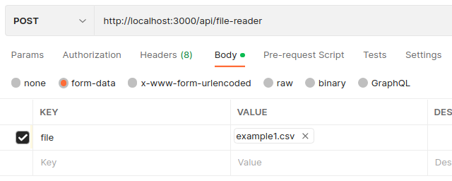

## Description

Proyect using Graphql, Nestjs, Kafka, Cockroachdb.

## Installation

```bash
$ npm install
```

## Running the app

Backend will run in PORT `3000` by default.

```bash
# development
$ npm run start

# watch mode
$ npm run start:dev
```

## Exercise 1 - Fetch Status

Shows the status of the services

If no id is sent it show all status in an array

```http
GET /api/status
```

Response:

```json
[
  {
    "id": 1,
    "status": 604
  },
  {
    "id": 2,
    "status": 606
  },
  {
    "id": 3,
    "status": 607
  }
]
```

Send an id to check the service status

```http
GET /api/status/{id}
```

Response:

```json
{
  "id": 1,
  "status": 604
}
```

If service id is not found, it will return `607` by default.

If id is not numeric, bad request will be shown:

```json
{
  "message": "Validation failed (numeric string is expected)",
  "error": "Bad Request",
  "statusCode": 400
}
```

## Exercise 2 - Create Ticket

Graphql mutation createTicket

```http
POST /graphql
```

For more information: `schema.gql`

Category enums: INCIDENT | SUPPORT | ERROR
Priority enums: HIGH | MEDIUM | LOW
Status enums: PENDING | VERIFIED | APPROVED | REJECTED

Status will always be created in `PENDING` as docs indicates

Example of post in mutation createTicket:

```graphql
mutation CreateTicket {
  createTicket(
    ticketInput: {
      title: "Error ticket"
      description: "test description"
      category: ERROR
      priority: HIGH
    }
  ) {
    category
    createdAt
    description
    id
    priority
    status
    title
  }
}
```

Using Apollo Server

Response will be:

```json
{
  "data": {
    "createTicket": {
      "category": "ERROR",
      "createdAt": "2023-10-24T20:48:20.799Z",
      "description": "test description",
      "id": "911252196280565761",
      "priority": "HIGH",
      "status": "PENDING",
      "title": "Error ticket"
    }
  }
}
```

This will trigger a call for endpoint status/1 GET in exercise 1, this response will be send to kafka in order to emit an update to the ticket status from pending to -> rejected if it's error sending param 3; verified if it's incident sending param 1 and finally approved if it's support sending param 2.

This all will be automatically updated within few seconds.

After update using kafka:

```json
{
  "data": {
    "findTicket": {
      "category": "ERROR",
      "description": "test description",
      "createdAt": "2023-10-24T20:48:20.799Z",
      "id": "911252196280565761",
      "priority": "HIGH",
      "status": "REJECTED",
      "title": "Error ticket"
    }
  }
}
```

## Exercise 3 - Find Ticket

Query findTicket to find a ticket with an id

```graphql
query FindTicket {
  findTicket(id: "911254385370791937") {
    category
    description
    createdAt
    id
    priority
    status
    title
  }
}
```

Response:

```graphql
{
  "data": {
    "findTicket": {
      "category": "SUPPORT",
      "description": "test description",
      "createdAt": "2023-10-24T20:59:28.867Z",
      "id": "911254385370791937",
      "priority": "HIGH",
      "status": "APPROVED",
      "title": "Error ticket"
    }
  }
}
```

If ticket is not found in the database it will return a `TICKET_NOT_FOUND` error

## EXERCISE 4 - Find by Filters

Find using parameters:

Example:

```graphql
query SearchTickets {
  searchTickets(args: { status: APPROVED, priority: HIGH }) {
    category
    createdAt
    description
    priority
    id
    status
    title
  }
}
```

Response:

```json
{
  "data": {
    "searchTickets": [
      {
        "category": "SUPPORT",
        "createdAt": "2023-10-24T20:44:23.736Z",
        "description": "test description",
        "priority": "HIGH",
        "id": "911251419386347521",
        "status": "APPROVED",
        "title": "Error ticket"
      },
      {
        "category": "SUPPORT",
        "createdAt": "2023-10-24T20:59:28.867Z",
        "description": "test description",
        "priority": "HIGH",
        "id": "911254385370791937",
        "status": "APPROVED",
        "title": "Error ticket"
      }
    ]
  }
}
```

This will response with a list of Tickets matching criterias

## EXERCISE 5 - Upload and Parse CSV

```http
POST /api/file-reader
```

With form data: 'file' send csv file

It will validate if file is csv, empty, no rows and data types in rows.



Example response:

```json
{
    "result": true,
    "detail": "Número de items con estructura correcta guardados: 2",
    "errorRows": [
        2,
        4,
        5
    ]
}
```
It will show number of rows saved in database and row index where it failes. In console log it shows why it is incorrect.


## Status Codes

Returns the following status codes in the API:

| Status Code | Description             |
| :---------- | :---------------------- |
| 200         | `OK`                    |
| 201         | `CREATED`               |
| 400         | `BAD REQUEST`           |
| 404         | `NOT FOUND`             |
| 500         | `INTERNAL SERVER ERROR` |

## Stay in touch

- Author - [Eduardo Nicolalde](https://www.linkedin.com/in/eduardo-nicolalde/)
- Website - [https://eduardo-nicolalde.vercel.app](https://eduardo-nicolalde.vercel.app)
````
