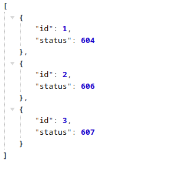
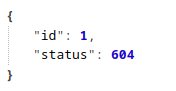

<p align="center">
  <a href="http://nestjs.com/" target="blank"></a>
</p>

## Description

Proyect using Graphql, Nestjs, Kafka, Cockroachdb.

## Installation

```bash
$ npm install
```

## Running the app

Backend will run in PORT `3000` by default.

```bash
# development
$ npm run start

# watch mode
$ npm run start:dev
```

## Exercise 1 - Fetch Status

Shows the status of the services

If no id is sent it show all status in an array
```http
GET /api/status
```
As follow:



Send an id to check the service status

```http
GET /api/status/{id}
```



If service id is not found, it will return `607` by default.

## Exercise 2 - Create Ticket


Graphql mutation createTicket

```http
POST /graphql
```
Example of post in mutation createTicket:

``` graphql
mutation CreateTicket {
  createTicket(ticketInput: {
    title: "Error ticket",
    description: "test description",
    category: ERROR,
    priority: HIGH,
  }) {
    category
    createdAt
    description
    id
    priority
    status
    title
  }
}
```

Using Apollo Server

Response will be:

```javascript
{
  "data": {
    "createTicket": {
      "category": "ERROR",
      "createdAt": "2023-10-24T19:49:52.642Z",
      "description": "test description",
      "id": "911240700688760833",
      "priority": "HIGH",
      "status": "PENDING",
      "title": "Error ticket"
    }
  }
}
```

## Status Codes

Returns the following status codes in the API:

| Status Code | Description |
| :--- | :--- |
| 200 | `OK` |
| 201 | `CREATED` |
| 400 | `BAD REQUEST` |
| 404 | `NOT FOUND` |
| 500 | `INTERNAL SERVER ERROR` |

## Stay in touch

- Author - [Eduardo Nicolalde](https://www.linkedin.com/in/eduardo-nicolalde/)
- Website - [https://eduardo-nicolalde.vercel.app](https://nestjs.com/)
